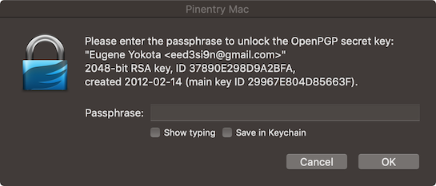

sbt-pgp
=======

sbt-pgp provides PGP signing for sbt.

Some OSS repositories (e.g. Sonatype) will require that you sign artifacts with publicly available keys prior to release. The primary purpose of sbt-pgp is to let you sign the artifacts using a GPG key.

Setup
-----

### For sbt 1.x:

Add the following to your `~/.sbt/1.0/plugins/gpg.sbt` file:

```scala
addSbtPlugin("com.jsuereth" % "sbt-pgp" % "2.0.0-M2")
```

### For sbt 0.13.x:

Add the following to your `~/.sbt/0.13/plugins/gpg.sbt` file:

```scala
addSbtPlugin("com.jsuereth" % "sbt-pgp" % "2.0.0-M2")
```

Usage
-----

There are two modes of use:

- By default sbt-pgp 2.0.0+ will use the `gpg` command-line utility (GNU Privary Guard, "GnuPG"). It provides great support and is available on many platforms.  You'll need to make sure this is installed prior to usage as this dependency is not provided.
- Prior to sbt-pgp 2.0.0, `sbt-pgp` used the [Bouncy Castle](http://www.bouncycastle.org/) library, an implementation of PGP that is included with the plugin. It is a Java-only solution that gives the plugin great flexibility in what it can do and how it performs it.

### Install GnuPG (or GNU Privary Guard, GPG)

First, please check that you have a recent version of GPG (GNU Privary Guard, "GnuPG") on your system. If not, install it from <http://www.gnupg.org/download/> or your favorite package manager. For macOS, we recommend using [GPG Suite](https://gpgtools.org/).

```
$ gpg --version
gpg (GnuPG/MacGPG2) 2.2.17
libgcrypt 1.8.4
Copyright (C) 2019 Free Software Foundation, Inc.
License GPLv3+: GNU GPL version 3 or later <https://gnu.org/licenses/gpl.html>
This is free software: you are free to change and redistribute it.
There is NO WARRANTY, to the extent permitted by law.

Home: /Users/xxxx/.gnupg
Supported algorithms:
Pubkey: RSA, ELG, DSA, ECDH, ECDSA, EDDSA
Cipher: IDEA, 3DES, CAST5, BLOWFISH, AES, AES192, AES256, TWOFISH,
        CAMELLIA128, CAMELLIA192, CAMELLIA256
Hash: SHA1, RIPEMD160, SHA256, SHA384, SHA512, SHA224
Compression: Uncompressed, ZIP, ZLIB, BZIP2
```

You should also have a program named `gpg-agent` running in the background.

```
$ ps aux | grep gpg
eed3si9n          5157   0.0  0.0  4317860    972   ??  Ss    7:17PM   0:00.02 gpg-agent --homedir /Users/eed3si9n/.gnupg --use-standard-socket --daemon
eed3si9n          2734   0.0  0.0  4300360    732   ??  S     6:56PM   0:00.02 /bin/bash /usr/local/MacGPG2/libexec/shutdown-gpg-agent
eed3si9n          5291   0.0  0.0  4277252    824 s002  S+    7:24PM   0:00.00 grep gpg
```

If you're using [GPG Suite](https://gpgtools.org/), navigate to Preferences > GPG Suite, and uncheck "Store in macOS Keychain" to prevent your passphrase from being stored on your laptop.

### Working with PGP signatures

See [Working with PGP Signatures](https://central.sonatype.org/pages/working-with-pgp-signatures.html) for details.

A key pair allows you to sign artifacts with GPG and users can subsequently validate that artifacts have been signed by you. You can generate a key with.

```
$ gpg --gen-key
```

Select the default value when asked for the kind (RSA) and the size (2048bit) of the key. The time of validity for the key defaults to never expire. However it is commonly suggested to use a value of less than 2 years. Once they key is expired you can extend it, provided you own the key and therefore know the passphrase.

Once key pair is generated, we can list them along with any other keys installed:

```
$ gpg --list-keys
/Users/xxx/.gnupg/pubring.gpg
----------------------------------
pub   dsa2048 2010-08-19 [SC] [expires: 2020-06-15]
      85E38F69046B44C1EC9FB07B76D78F0500D026C4
uid           [ultimate] GPGTools Team <team@gpgtools.org>
uid           [ultimate] GPGTools Project Team (Official OpenPGP Key) <gpgtools-org@lists.gpgtools.org>
uid           [ultimate] GPGMail Project Team (Official OpenPGP Key) <gpgmail-devel@lists.gpgmail.org>
uid           [ultimate] [jpeg image of size 5871]
sub   elg2048 2010-08-19 [E] [expires: 2020-06-15]
sub   rsa4096 2014-04-08 [S] [expires: 2024-01-02]

pub   rsa2048 2012-02-14 [SCEA] [expires: 2028-02-09]
      2BE67AC00D699E04E840B7FE29967E804D85663F
uid           [ultimate] Eugene Yokota <eed3si9n@gmail.com>
sub   rsa2048 2012-02-14 [SEA] [expires: 2028-02-09]

....
```

To list the private keys you can use:

```
$ gpg --list-secret-keys
/Users/xxx/.gnupg/pubring.gpg
----------------------------------
sec   rsa2048 2012-02-14 [SCEA] [expires: 2028-02-09]
      2BE67AC00D699E04E840B7FE29967E804D85663F
uid           [ultimate] Eugene Yokota <eed3si9n@gmail.com>
ssb   rsa2048 2012-02-14 [SEA] [expires: 2028-02-09]
```

Since other people need your **public** key to verify your files, you have to distribute your public key to a key server:

```
$ gpg --keyserver hkp://pool.sks-keyservers.net --send-keys 2BE67AC00D699E04E840B7FE29967E804D85663F
```

### Publishing Artifacts

To publish signed artifacts, use `publishSigned` or `publishLocalSigned`.

### Skipping publishing

To skip the publish step for a subproject, set `publish / skip` to `true`.

```
publish / skip := true
```

### PIN entry (passphrase entry)

If you've configured your gpg-agent with [GPG Suite](https://gpgtools.org/), it should ask for the passphrase when you run `publishLocalSigned`:



Note: It might take 30s or more for the dialog to show up.

Otherwise, add `pinentry-program` line in `~/.gnupg/gpg-agent.conf` with the appropriate path to a pinentry program:

```
pinentry-program /usr/bin/pinentry
default-cache-ttl 600
max-cache-ttl 7200
```

You might need to restart the gpg-agent for the setting to take effect.

#### OpenPGP Support

If you are using a [Yubikey 4](https://www.yubico.com/product/yubikey-4-series/) or another smartcard that [supports OpenPGP](https://incenp.org/notes/2016/openpgp-card-implementations.html), then you may have private keys implemented directly on the smartcard rather than using the gpg keyring.  In this situation, you will use `gpg-agent` and a pinentry (`pinentry-mac`, `pinentry-qt`, `pinentry-curses` etc) rather than a passphrase.  Set `useGpgPinentry := true` in your `build.sbt` settings to configure `sbt-pgp` appropriately.

```scala
Global / useGpgAgent := true
Global / useGpgPinentry := true
```

Note that `sbt-pgp` only supports OpenPGP through the GPG command line tool -- it is not available through bouncycastle.  In addition, you may need to explicitly [enable support for OpenPGP on the Yubikey 4](https://github.com/drduh/YubiKey-Guide).

### Configuration: gpg command-line

`sbt-pgp` needs to know where the `gpg` executable is to run.  It will look for a either a `gpg` or `gpg.exe` executable on your `PATH` depdending on your platform.  To configure a different location, place the following in your `~/.sbt/gpg.sbt` file:

```scala
Global / gpgCommand := "/path/to/gpg"
```

By default `sbt-pgp` will use the default private keys from the standard gpg keyrings.   If you'd like to use a different private key for signing artifacts, add the following to your `~/.sbt/gpg.sbt` file:

```scala
Global / pgpSecretRing := file("/path/to/my/secring.gpg")
```

There is currently no way to choose a non-default key from the keyring.

### Configuration: Key Pair Locations

If you'd like to use a key that isn't in the standard location, you can configure it in your `~/.sbt/gpg.sbt` file:

```scala
Global / pgpSecretRing := file("/tmp/secring.asc")
Global / pgpPublicRing := file("/tmp/pubring.asc")
```

### Configuration: Signing Key

If you'd like to use a different private key besides the default, then you can configure it with the `pgpSigningKey` settings. 

You can either configure the key using raw long integer values:

```scala
Global / pgpSigningKey := Some(9005184038412874530)
```

or you can use the `usePgpKeyHex` method.

```scala
Global / usePgpKeyHex("7cf8d72be29df322")
```

Note:  While it is general practice to drop the higher-order bits of 64-bit integer keys when passing ids around, the PGP plugin requires the full key id currently.

### Configuration: Public Key Ring

You can configure the public key ring you use with the `gpgPublicRing` setting.

```scala
Global / pgpPublicRing := file("/home/me/pgp/pubring.asc")
```

By default the `~/.gnupg/pubring.gpg` file is used, if it exists.

### Validating PGP Keys

The plugin can be used to validate the PGP signatures of the dependencies of the project you're using.   To validate these signatures, simply use the `checkPgpSignatures` task:

```
> checkPgpSignatures
[info] Resolving org.scala-lang#scala-library;2.9.1 ...
...
[info] ----- PGP Signature Results -----
[info]                    com.novocode : junit-interface :        0.7 : jar   [MISSING]
[info]               javax.transaction :             jta :     1.0.1B : jar   [MISSING]
[info]          org.scala-lang.plugins :   continuations :      2.9.1 : jar   [MISSING]
[info]                org.apache.derby :           derby : 10.5.3.0_1 : jar   [UNTRUSTED(0x98e21827)]
[error] {file:/home/josh/projects/typesafe/test-signing/}test-gpg/*:check-pgp-signatures: Some artifacts have bad signatures or are signed by untrusted sources!
[error] Total time: 2 s, completed Jan 23, 2012 12:03:28 PM
```

In the above output, the signature for derby is from an untrusted key (id: `0x98e21827`).  You can import this key into your public key ring, and then the plugin will trust artifacts from that key.   The public, by default, accepts any keys included in your public key ring file.

### Importing and Exporting Keys from Public Key Servers

Note: To import a key, you have to turn off read only mode:

```scala
Global / pgpReadOnly := false
```

Use the `receive-key` command to import keys.

```
pgp-cmd receive-key <key id> hkp://keyserver.ubuntu.com
```

Use the `send-key` command to export keys.

``scala
pgp-cmd send-key <key id> hkp://keyserver.ubuntu.com
```

The value of `key id` is one of the following:

* Hex Key ID
* "Name" of the key (e.g. "LAMP/EPFL" in the above example)
* "Email" of the key (e.g. "lamp@gmail.com" in the above example)

### Using Bouncy Castle

Prior to sbt-pgp 2.0.0, `sbt-pgp` used the [Bouncy Castle](http://www.bouncycastle.org/) library by default. If you cant to use the built-in Bouncy Castle PGP implementation, this can be overriden with:

```scala
Global / useGpg := false
```

Or by setting `SBT_PGP_USE_GPG` environment variable to `0`.

When using Bouncy Castle modue, `sbt-pgp` will ask for your password once, and cache it for the duration of the sbt process. The prompt will look something like this:

```
Please enter PGP passphrase (or ENTER to abort): ******
```

#### PIN entry (passphrase Entry) for Bouncy Castle

`sbt-pgp` has provided a means to store passphrase using `pgpPassphrase`, but we no longer recommend using this method.

```
Global / pgpPassphrase := Some(Array('M', 'y', 'P', 'a', 's', 's', 'p', 'h', 'r', 'a', 's', 'e'))
```

Also make sure that the above setting is in a user-specific directory and that you don't advertise your password in the source code repository!

Another alternative for configuring the passphrase is to add it to your credentials, using a host name of `pgp`.  This allows you to globally configure a passphrase without having the pgp plugin installed globally.

For example, create the following file `~/.sbt/pgp.credentials`:

```
realm=PGP Secret Key
host=pgp
user=sbt
password=MyPassphrase
```

The `realm` and `user` values can be anything, the `host` must be `pgp`, and `password` must be your passphrase. Now add the this file to your sbt credentials in `~/.sbt/1.0/global.sbt`:

```
credentials += Credentials(Path.userHome / ".sbt" / "pgp.credentials")
```
